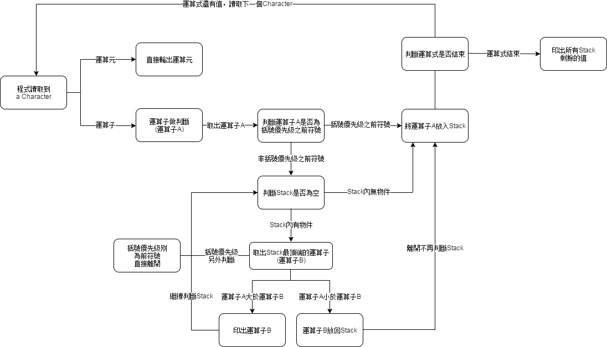

# InfixToPostfix

# 說明

中序轉後序是演算法基礎的方式之一，原因是電腦無法閱讀一般運算式，

也就是中序(如A+B)，所以要變成電腦可閱讀的方式，即後序(AB+)。

雖然已有許多範例，但是對於初學者來看這樣的概念並非容易入門。

本篇是以java來做一個中序轉後序的概念解說。

* * *
# 基礎

中序囀後序在電腦實作上必須要有一個Stack(堆疊)、pop(彈出)與push(推入)
<ul>
<li>Stack(堆疊)：物件依序放入，像一個袋子，使用者只能從最上面開始依序取出物件。</li>
<li>push(推入)：將物件放進去Stack裡面的最頂端。</li>
<li>pop(彈出)：取出Stack最頂端的物件。</li>
<li>isEmpty(空值)：判斷Stack是否沒東西了。</li>
</ul>

通常在程式的概念就是一個有順序的Array(陣列)，在Java中可以用LinkedList實作以上

但這邊直接使用Java提供已經包含上述方法的java.util.Stack來實作。
* * *
# 流程

中序轉後序，就是在於比較運算子的大小，運算子是有大小之分的

程式則是由左至右讀取，每當遇到運算元就直接輸出，遇到運算子做處理。

<ul>
<li>.程式開始運行，以character為單位讀取</li>
<li>判斷為運算元還是運算子</li>
<li>運算子做判斷，括號優先級先處理</li>
<li>判斷Stack是否為空</li>
<li>比較Stack內的運算子與現有運算子的大小</li>
<li>放入此運算子繼續讀取下一個，直到完全空值</li>
<li>秀出所有結果</li>
</ul>

這邊看起來稍微複雜，不過只要將運算子帶入就可以知道流程

* * *
# 原則

要達到中序轉後序，主要為處理運算子

基本原則如下：

<ul>
<li>遇到運算元直接輸出</li>
<li>遇到運算子做判斷</li>
<li>括號優先處理</li>
<li>現有的運算子比Stack內的運算子大則直接輸出</li>
<li>現有的運算子比Stack內的運算子小則放回Stack</li>
<li>最後清空Stack</li>
</ul>

這邊使用 "+ -" 與 "* /" 和 "()"作為範例。

* * *
# 實作

使用語言為Java

這邊使用的方式是較容易的switch與case

原因是大多數的範例寫得過於簡略，較不易初學者學習

所以運用這樣的方式可以更容易了解過程。

## 1.定義所需的物件

<ul>
<li>Java的Stack：已經包含pop、push、isEmpty方法，或者可以用LinkedList製作方法。</li>
<li>Character：放入Stack內的型別，可以視為一個一個的字元</li>
<li>Empty postfix:空字串，用來放結果，必須一個一個印出來，轉後序</li>
<li>infix :中序式，一般常見的運算式</li>
</ul>

  	String infix = "1+2";
  	String postfix = "";
    Stack<Character> javaStack = new Stack<Character>(); 

##  2.處理運算元與運算子

範例順序使用括號、加減、乘除，所以權重為：

括號 > 乘除 > 加減

* * *
然後Stack在使用上的原則為：

先進後出，後進後出：最後放進去的一定最先拿出來

取出後即減少：不像一般陣列只是虛擬値，例如拿出Stack內的A物件，A物件就會再Stack內不見
* * *

先寫一個Each loop，並且放入整個運算式字串，讓其可以轉為一個一個char做判斷，直到字串結束

    for(char ch: infix.toCharArray()){

    }

接著寫一個switch,case，讓程式可以不斷的判斷當前的character

    for(char ch: infix.toCharArray()){
      switch(ch){
        case:break;
        default:break;
      }
    }

* * *

首先，根據原則：運算元直接輸出，所以直接輸出運算元，所以default就是直接印出運算元，

並且把它加到空的後序是postfix中，這也表示慢慢我們可以印出後序，

預設default表示當下的character沒有任何case符合，而case是判斷運算子用的，所以default為運算元

    for(char ch: infix.toCharArray()){
      switch(ch){
        case:break;
        default: postfix = postfix + ch ;break;
      }
    }

### 先判斷加減

接著優先判斷加減，習慣從權重最小的開始寫，這樣比較好理解，

這理case要判斷兩個，因為加減同權重，記得要用''不能使用""，這樣才能判斷character
    
    
    for(char ch: infix.toCharArray()){
      switch(ch){
        case '+' :
        case '-' : break;
        default: postfix = postfix + ch ;break;
      }
    }

如果遇到的運算子為+或者為-，要先判斷Stack是否為空，如果沒有則直接放入Stack

使用while可以不斷判斷stack，指要從stack拿出來就會減少，直到空的

    for(char ch: infix.toCharArray()){
      switch(ch){
        case '+' :
        case '-' : 
         while(!javaStack.isEmpty()){    
                                             }; break;
        default: postfix = postfix + ch ;break;
      }
    }
    
如果Stack內有值，就必須拿出來與現在有的+或者-做大小的比對，

運用Stack的pop取出最後一個值，每次取出Stack內都會減少，空了不再做迴圈

    for(char ch: infix.toCharArray()){
      switch(ch){
        case '+' :
        case '-' : 
         while(!javaStack.isEmpty()){    
           char topch = javaStack.pop();  }; break;
        default: postfix = postfix + ch ;break;
      }
    }

如果與現在有運算子權重一樣大或者比較小，就直接印出來。
	
    for(char ch: infix.toCharArray()){
      switch(ch){
        case '+' :
        case '-' : 
         while(!javaStack.isEmpty()){    
           char topch = javaStack.pop();  
           if(topch == '*' || topch == '/'){postfix = postfix + topch;}
           }; break;
        default: postfix = postfix + ch ;break;
      }
    }
    
    
最後記得把現有的運算子放進Stack，簡單說不管如何現有運算子一定會放入Stack就對了！

    for(char ch: infix.toCharArray()){
      switch(ch){
        case '+' :
        case '-' : 
         while(!javaStack.isEmpty()){    
           char topch = javaStack.pop();  
           if(topch == '*' || topch == '/'){postfix = postfix + topch;}
           }; 
              javaStack.push(ch);
           break;
        default: postfix = postfix + ch ;break;
      }
    }
    
    
* * *

以A+B-C+D為例，這邊只有+與-

判斷過程為：

    case A  : 印出運算元  =======>  postfix : A 

    case +  : 判斷運算子 
            : Stack為空值 
            : 放入運算子  =======>  postfix : A  , Stack: +

    case B  : 印出運算元  =======>	 postfix : AB  , Stack : +

    case -  : 判斷運算子 :
              Stack不為空值 : 
              取出Stack的最後一個判斷權重 : 
              運算子-一樣大所以印出來(Stack內最後運算子) : 
              把現在的運算子放入Stack =======>  postfix : AB+  , Stack : -

    case C	: 印出運算元  =======>	 postfix : AB+C  , Stack : -	

    case +	: 判斷運算子 :
              Stack不為空值 : 
              取出Stack的最後一個判斷權重 : 
              運算子+一樣大所以印出來(Stack內最後運算子): 
              把現在的運算子放入Stack =======>	postfix : AB+C-  , Stack : +	

    case D  : 印出運算元  =======>	 postfix : AB+C-D  , Stack : +

    最後清空Stack印出全部 AB+C-D+

這邊的目的是，根據後序法的規則，Stack內每個權重一樣的運算子都只會有一個(例如一個乘或者一個加)，

A+B-C+D 轉後序會變成 AB+C-D+，在程式上的Stack就是要把+暫時存放到最後才印出來，才會變成後序。

* * *

### 再判斷乘除

處理完加減之後，加入乘除，雖然邏輯一樣，但是在判斷上需要改變

case如果遇到乘或者除，進入判斷(遇到運算子為乘或者除，Case為乘或者除)

    for(char ch: infix.toCharArray()){
      switch(ch){
        case '*' :
        case '/' :  break;
        default: postfix = postfix + ch ;break;
      }
    }

如果Stack內有値，拿出來與Case比對，Stack內的運算子可能會有加減或者乘除(後面解釋)

    for(char ch: infix.toCharArray()){
      switch(ch){
        case '*' :
        case '/' : 
         while(!javaStack.isEmpty()){    
           char topch = javaStack.pop();  }; break;
        default: postfix = postfix + ch ;break;
      }
    }

如果為乘除，表示一樣大，根據原則直接印出這個乘除

(運算子比對，一樣大直接印出Stack內取得的運算子)

    
    for(char ch: infix.toCharArray()){
      switch(ch){
        case '*' :
        case '/' : 
         while(!javaStack.isEmpty()){    
           char topch = javaStack.pop();  
           if(topch == '*' || topch == '/'){postfix = postfix + topch;}
           }; break;
        default: postfix = postfix + ch ;break;
      }
    }    
    
如果為加減，表示加減比Case小，這時要把加減放回Stack，不在往下判斷，

原因是，Stack拿來取最後放入的値，放回去表示Stack不可能為空，所以一定要Break否則會進入無窮迴圈。

依照後序法，權重較輕的必須在後面印出，現在case為乘除，如果遇到Stack內是加減表示權重較小所以不能輸出要放回去

如A+B*C，結果應該要變成 ABC*+

    for(char ch: infix.toCharArray()){
      switch(ch){
        case '*' :
        case '/' : 
         while(!javaStack.isEmpty()){    
           char topch = javaStack.pop();  
           if(topch == '*' || topch == '/'){postfix = postfix + topch;}
           if(topch == '+' || topch == '-'){javaStack.push(topch); break;}
           }; break;
        default: postfix = postfix + ch ;break;
      }
    }      

最後再把這個Case放進Stack，如果Stack本身是空，那就可以直接放入。

    for(char ch: infix.toCharArray()){
      switch(ch){
        case '*' :
        case '/' : 
         while(!javaStack.isEmpty()){    
           char topch = javaStack.pop();  
           if(topch == '*' || topch == '/'){postfix = postfix + topch;}
           if(topch == '+' || topch == '-'){javaStack.push(topch); break;}
           }; 
              javaStack.push(ch);
           break;
          default: postfix = postfix + ch ;break;
      }
    }  

這邊就完成了case為乘除的判斷。

然後加入剛才的加減就可以測試

## 與前面的加減合併，這時可以判斷加減乘除

    for(char ch: infix.toCharArray()){
      switch(ch){
        case '+' :
        case '-' : 
         while(!javaStack.isEmpty()){    
           char topch = javaStack.pop();  
           if(topch == '*' || topch == '/'){postfix = postfix + topch;}
           }; 
              javaStack.push(ch);
           break;
        case '*' :
        case '/' : 
         while(!javaStack.isEmpty()){    
           char topch = javaStack.pop();  
           if(topch == '*' || topch == '/'){postfix = postfix + topch;}
           if(topch == '+' || topch == '-'){javaStack.push(topch); break;}
           }; 
              javaStack.push(ch);
           break;
          default: postfix = postfix + ch ;break;
      }
    }
    
    
* * *

以A+B*C為例，這邊加入了乘除

判斷過程為：

	case A  : 印出運算元  =======>  postfix : A  

	case +  : 判斷運算子 
          	: Stack為空 
		: 放入運算子  =======> postfix : A  ,  Stack : +

	case B  : 印出運算元  =======>	postfix : AB  ,  Stack : +

	case *  : 判斷運算子
		: Stack不為空 
		: 取出Stack的最後一個判斷權重 
		: 運算子+比較小所以放回Stack(Stack內最後運算子)，然後離開判斷
		: 再把現在的運算子*放入Stack =======>  postfix : AB  ,  Stack : + *

	case C	: 印出運算元 =======>  postfix : ABC  ,  Stack : + *

	根據原則，後進先出，最後印出來會先印出*再印出+ 	=====>  postfix : ABC*+

* * *

處理完乘除，還需要處理前面的加減，因為進入加減判斷的時候，Stack內也是有可能會有乘除

#### 這邊就要解釋為什麼在乘除中Stack內有可能會有乘與除。

#### 例如 A*B+C，依據原則，*是第一次遇到，所以直接放入Stack內，

#### 這時候*會被放到Stack中，到了case為+的時候就要判定Stack內的*。

當Case為加減，Stack內不為空而且為乘除的時候

乘除大於當前的Case，所以一樣把Stack取得的運算子印出來

加到case為加減的部分，就可以完成加減乘除的判斷

    for(char ch: infix.toCharArray()){
      switch(ch){
        case '+' :
        case '-' : 
         while(!javaStack.isEmpty()){    
           char topch = javaStack.pop();  
           if(topch == '*' || topch == '/'){postfix = postfix + topch;}
           if(topch == '+' || topch == '-'){postfix = postfix + topch;}
           }; 
              javaStack.push(ch);
           break;
        default: postfix = postfix + ch ;break;
      }
     }

因為Stack內不管是加減或者乘除，權重都不會小於Case，所以都印出來

通常當Case為加減，判斷到乘除的時候，Stack內一定會有一個乘或者除，還有一個加或者減

而且Stack原則就是先進先後出、後進先出，並且在加上前面的判斷後，即可完成加減乘除的判斷。

## 加減的部分在加入對於乘除的判斷後，就可以完成加減乘除的判斷

    for(char ch: infix.toCharArray()){
      switch(ch){
        case '+' :
        case '-' : 
         while(!javaStack.isEmpty()){    
           char topch = javaStack.pop();  
           if(topch == '*' || topch == '/'){postfix = postfix + topch;}
           if(topch == '+' || topch == '-'){postfix = postfix + topch;}
           }; 
              javaStack.push(ch);
           break;
        case '*' :
        case '/' : 
           while(!javaStack.isEmpty()){    
           char topch = javaStack.pop();  
           if(topch == '*' || topch == '/'){postfix = postfix + topch;}
           if(topch == '+' || topch == '-'){javaStack.push(topch); break;}
           }; 
              javaStack.push(ch);
           break;
          default: postfix = postfix + ch ;break;
      }
    }

* * *

剛才的範例只有到A+B*C，因為沒有判斷case為加減時，

如果Stack內為乘除的判斷，所以這時才能夠完整判斷正常的加減乘除。

這裡以A+B*C-D為例：

	
    case A  : 印出運算元  =======>  postfix : A  

    case +  : 判斷運算子 : Stack為空 :放入運算子  =======>  postfix : A  ,  Stack : +

    case B  : 印出運算元  =======>	postfix : AB  ,  Stack : +

    case *  : 判斷運算子 
            : Stack不為空 
            : 取出Stack的最後一個判斷權重 
            : 運算子+比較小所以放回Stack(Stack內最後運算子)，然後離開判斷
            : 再把現在的運算子*放入Stack =======>  postfix : AB  ,  Stack : +*

    case C	: 印出運算元  =======>  postfix : ABC , Stack : +*	

    case -	: 判斷運算子 
            : Stack不為空 
            : 取出Stack的最後一個判斷權重 
            : 運算子*比較大所以印出Stack(Stack內最後運算子) =======>  postfix : ABC*	
            : 判斷下一個Stack內的運算子
            : 運算子+一樣大所以印出Stack(Stack內最後運算子) =======>  postfix : ABC*+
            : Stack為空，離開判斷
            : 把現在的運算子放入Stack =======>  postfix : ABC*+ ,  Stack : -	

    case D  : 印出運算元   =======>	postfix : ABC*+D   ,  Stack : -

    最後清空Stack印出全部 ABC*+D-

* * *

這時候，如果直接計算結果，會發現結果又問題，原因是：

#### 先乘除，後加減，問題是程式是由左至右，它無法判定你的加或者減誰優先

#### 所以，最重要的就是要處理括號，括號的用意就是要讓他優先計算。

* * *

### 判斷括號，括號分為前括號與後括號

括號代表最優先判斷，包含了陣列標註、函式呼叫等等

這邊以括號作為範例，括號分為前面與後面，表示開始與結束。

如果進入括號後，就會重新判斷Stack內的排序，

因為括號內的算式優先判斷，所以只要看到前括號就直接放入Stack。

    for(char ch: infix.toCharArray()){
      switch(ch){
        case '(' : javaStack.push(ch);break;
        default: postfix = postfix + ch ;break;
      }
    }
    
舉例來說，以A*(B+C)，*會先放入Stack，

但是根據原則，括號在Stack全重最小，所以遇到前括號會比*小，所以直接放入。

這樣才能讓程式做到"括號內優先判斷"。

* * *

括號內優先判斷，所以Stack也會重算，這時候Stack內的最後一個運算子一定為括號

這時候接下來遇到的運算子有可能為加減或者乘除，所以case會到加減或者乘除做判斷。

然後根據原則，括號在Stack內權重為最小，
所以Stack拿出來為括號，權重一定比乘除或者加減小，直接放回去並離開。

    for(char ch: infix.toCharArray()){
      switch(ch){
        case '+' :
        case '-' : 
         while(!javaStack.isEmpty()){    
           char topch = javaStack.pop();  
           if(topch == '*' || topch == '/'){postfix = postfix + topch;}
           if(topch == '+' || topch == '-'){postfix = postfix + topch;}
           if(topch == '('){ javaStack.push(topch);break;}
           }; 
                javaStack.push(ch);
           break;
        case '*' :
        case '/' : 
           while(!javaStack.isEmpty()){    
           char topch = javaStack.pop();  
           if(topch == '*' || topch == '/'){postfix = postfix + topch;}
           if(topch == '+' || topch == '-'){javaStack.push(topch); break;}
           if(topch == '('){javaStack.push(topch); break;}
           }; 
              javaStack.push(ch);
           break;
        case '(' : javaStack.push(ch);break;    
        default: postfix = postfix + ch ;break;
      }
    }

這麼一來當程式讀取到括弧就會優先判斷，並且在進去後不論遇到什麼運算子都會先放入，

尤於這裡只設定加減乘除，所以接下來case就會再遇到加減或者乘除，所以就會繼續判斷下去。
    
譬如A/B*(C+D)，這時候當前括號放入Stack後，下一個遇到加時，判斷Stack內括號還是會放回去，

這時候不管Stack內括號以前的運算子是什麼都不會受到影響。

* * *

最後判斷後括號，代表括號結束。

如果判斷遇到了後括號，一樣需要判斷Stack內是否為空的，並且做比對，

這麼做是要把在括號內殘餘的運算子印出，括號內為優先，所以括號內的運算子不會放到外面。

    for(char ch: infix.toCharArray()){
      switch(ch){
        case ')' :
         while(!javaStack.isEmpty()){    
           char topch = javaStack.pop();  }; break;
        default: postfix = postfix + ch ;break;
      }
    }
    
這個時候，Pop出來的運算子有可能為加減也有可能為乘除，

但是前面經過加減與乘除的判斷後，順序最多從最頂點開始為乘除>>加減>>前括號，

所以不管遇到乘除或者加減或者乘除都可以直接印出，

遇到前括號則代表括號結束，因為後續法不會印出括號所以直接離開，不放括號進Stack。

    for(char ch: infix.toCharArray()){
      switch(ch){
        case ')' :
         while(!javaStack.isEmpty()){
           char topch = javaStack.pop();
           if(topch == '*' || topch == '/'){postfix = postfix + topch;}
           if(topch == '+' || topch == '-'){postfix = postfix + topch;}
           if(topch == '('){break;}
           }; 
           break;
        default: postfix = postfix + ch ;break;
      }
    }

* * *

做一個簡單的範例

以A+(B*C/D)為例，這時可以看括號內的判斷

判斷過程為：

        case A  : 印出運算元  =======>  postfix : A  

        case +  : 判斷運算子 
                : Stack為空 
                : 放入運算子  =======> postfix : A  ,  Stack : +

        case (  : 運算子為前括號，直接放入Stack  =======>	postfix : A  ,  Stack : + (

        case B  : 印出運算元  =======>	postfix : AB  ,  Stack : + (

        case *  : 判斷運算子 
                : Stack不為空 
                : 取出Stack的最後一個判斷權重 
                : 運算子為前括號，括號權重最小放回去並離開			
                : 再把現在的運算子*放入Stack =======>  postfix : AB  ,  Stack : + ( *        

        case C  : 印出運算元 ======>  postfix : ABC  ,  Stack : + ( *

        case /  : 判斷運算子 
                : Stack不為空 
                : 取出Stack的最後一個判斷權重 
                : 運算子*一樣大所以印出Stack(Stack內最後運算子)  =======>  postfix : ABC*  ,  Stack : + ( 
                : 運算子(比較小所以放回Stack(Stack內最後運算子)，然後離開判斷(括號在stack內最小)
                : 再把現在的運算子*放入Stack =======>  postfix : ABC*  ,  Stack : + ( /

        case D  : 印出運算元 ======>  postfix : ABC*D  ,  Stack : + ( /

        case )  : 判斷運算子
                : Stack不為空，運算子為後括號表示取得的運算子為前括號後要離開
                : 運算子/遇到括號直接印出 =======>  postfix : ABC*D/  ,  Stack : + ( 	
                : 運算子(為前括號，直接離開 =======>  postfix : ABC*D/  ,  Stack : +  	

        根據原則，後進先出，最後印出來會先印出*再印出+ 	=====>  postfix : ABC*D/+
 
* * *

## 寫下清空剩下的Stack後，完成了中序轉後序
      
其實在前面測試就可以加入，像是範例最後清空Stack，

把剩下的運算子清空即可完成。

		while (!javaStack.isEmpty()) {

			postfix = postfix + javaStack.pop();

		}

* * *

## 最後的中序轉後序的程式碼

    for(char ch: infix.toCharArray()){
      switch(ch){
        case '+' :
        case '-' : 
         while(!javaStack.isEmpty()){    
           char topch = javaStack.pop();  
           if(topch == '*' || topch == '/'){postfix = postfix + topch;}
           if(topch == '+' || topch == '-'){postfix = postfix + topch;}
           if(topch == '('){ javaStack.push(topch);break;}
           }; 
                javaStack.push(ch);
           break;
        case '*' :
        case '/' : 
           while(!javaStack.isEmpty()){    
           char topch = javaStack.pop();  
           if(topch == '*' || topch == '/'){postfix = postfix + topch;}
           if(topch == '+' || topch == '-'){javaStack.push(topch); break;}
           if(topch == '('){javaStack.push(topch); break;}
           }; 
              javaStack.push(ch);
           break;
        case '(' : javaStack.push(ch);break;
        case ')' :
           while(!javaStack.isEmpty()){
           char topch = javaStack.pop();
           if(topch == '*' || topch == '/'){postfix = postfix + topch;}
           if(topch == '+' || topch == '-'){postfix = postfix + topch;}
           if(topch == '('){break;}
           }; 
           break;        
        default: postfix = postfix + ch ;break;
      }
    }
    
		while (!javaStack.isEmpty()) {

			postfix = postfix + javaStack.pop();

		}
    
    
最後就可以正常的中序轉後序

例子，(A+B)*(C-D)/E

        case (  : 運算子為前括號，直接放入Stack  =======>	postfix :   ,  Stack : (

        case A  : 印出運算元  =======>	postfix : A  ,  Stack : (  

        case +  : 判斷運算子 
                : Stack不為空 
                : 運算子為前括號，括號權重最小放回去並離開
                : 再把現在的運算子+放入Stack =======>  postfix : A  ,  Stack : ( +

        case B  : 印出運算元  =======>	postfix : AB  ,  Stack : + (   

        case )  : 判斷運算子
                : Stack不為空，運算子為後括號表示取得的運算子為前括號後要離開
                : 運算子+遇到括號直接印出  =======>  postfix : AB+  ,  Stack : ( 	
                : 運算子(為前括號，直接離開  =======>  postfix : AB+  ,  Stack :     

        case *  : 判斷運算子 
                : Stack為空直接放入運算子  =======>  postfix : AB+  ,  Stack : *

        case (  : 運算子為前括號，直接放入Stack  =======>	postfix : AB+  ,  Stack : * (

        case C  : 印出運算元 ======>  postfix : AB+C  ,  Stack : * (

        case -  : 判斷運算子 
                : Stack不為空 
                : 運算子為前括號，括號權重最小放回去並離開
                : 再把現在的運算子-放入Stack =======>  postfix : AB+C  ,  Stack : * ( -

        case D  : 印出運算元 ======>  postfix : AB+CD  ,  Stack : * ( -

        case )  : 判斷運算子
                : Stack不為空，運算子為後括號表示取得的運算子為前括號後要離開
                : 運算子-遇到括號直接印出  =======>  postfix : AB+CD-  ,  Stack : * (  	
                : 運算子(為前括號，直接離開  =======>  postfix : AB+CD-  ,  Stack : *        

        case /  : 判斷運算子 
                : Stack不為空 
                : 取出Stack的最後一個判斷權重 
                : 運算子*一樣大所以印出Stack(Stack內最後運算子)  =======>  postfix : AB+CD-*  ,  Stack : 
                : Stack不為空，離開判斷
                : 再把現在的運算子/放入Stack =======>  postfix : AB+CD-*  ,  Stack : /

        case E  : 印出運算元 =======>  postfix : AB+CD-*E  ,  Stack : /

        最後清空Stack 	=======>  postfix : AB+CD-*E/
 
 
以上就是一個簡單的演算法中序轉後序的範例，雖然程式碼較長，但是可以很清楚知道運作方式。 
 
* * *

# 總結
事實上，已經有許多相關的中序轉後序的寫法，甚至更為簡單，

但是，其實如果這麼做很難感受到電腦讀取的過程是怎麼轉成後續的，

所以為了這個目標，透過漸進式的方式，可以徹底地感受到電腦是如何一步一步將中序式轉成後序式，

如此一來也能讓初學者能夠更了解一個基本的概念。
